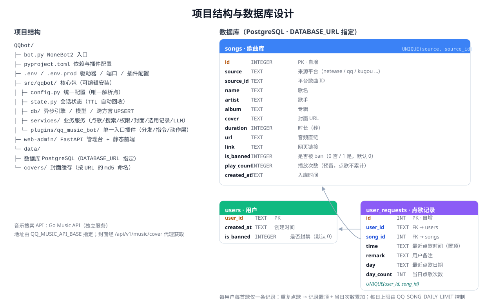
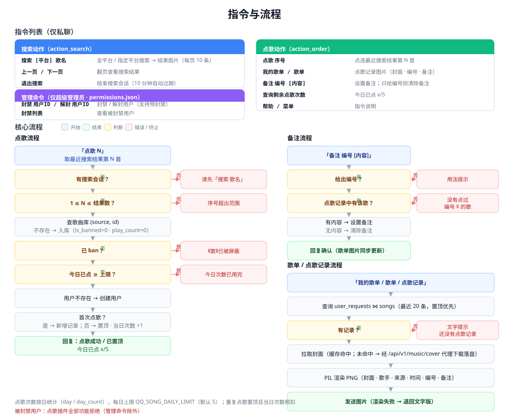

# QQ 点歌机器人（第三方 · NapCat + NoneBot2）

基于 **NapCat（协议端，登录个人 QQ 号）+ NoneBot2（Python 框架）** 的 QQ 音乐机器人：成员在**私聊机器人**时搜索歌曲、点歌，机器人把结果绘制成图片返回，点歌记录存入 SQLite。

> ⚠️ 本方案登录的是**个人 QQ 号**（建议小号），有被风控/封号风险，非腾讯官方，请自行评估。
>
> 音乐搜索依赖自建的 **Go Music API**（跨平台音乐搜索/解析服务），需另行部署并配置 `QQ_MUSIC_API_BASE`。

## 功能
- **音乐搜索**：发 `搜索 歌名`（可加平台前缀如 `搜索 qq 晴天`）多平台搜索，结果以图片返回（每页 10 条），`上一页`/`下一页` 翻页。
- **点歌**：发 `点歌 序号` 点选最近一次搜索结果中的歌曲；每日有上限，重复点歌会把该歌置顶歌单且当日次数照扣。
- **分享点歌（推荐）**：直接把 QQ 音乐/网易云等**歌曲分享卡片**发给机器人，由大模型理解并让 go-music-api 精确搜索，返回**结果图**，确认后即可自动点歌。
- **加好友欢迎**：成为好友后自动发送**欢迎词 + 功能清单**（重点提示可直接分享点歌）。
- **我的歌单**：发 `我的歌单`/`歌单` 查看点歌记录图片（含封面、歌手、来源、时间、歌曲编号、备注）。
- **备注**：发 `备注 编号 内容` 给已点歌曲加备注，`备注 编号` 清除备注。
- **查询剩余点歌次数**：返回「今天已点 X/上限 首」。
- **管理命令**：`封禁 用户ID` / `解封 用户ID` / `封禁列表`（仅超级管理员）；被封禁用户无法使用点歌功能。
- **AI 智能助手（可选，默认关闭）**：对接任意 OpenAI 兼容大模型（DeepSeek / 智谱 GLM / 通义千问 / Kimi），私聊消息先交给大模型理解意图，再调用上面这些音乐功能；回复是傲娇小猫“咪”的口吻，支持多轮对话、并自动避免工具结果与大模型回复重复。配置 `LLM_ENABLED=true` 后开启。
- **权限分级（三级）**：用户、管理员、超级管理员。管理员额外可**重置所有人点歌次数**、**禁播/解禁歌曲**；超级管理员额外可**封禁/解封用户**。权限只能通过 `data/permissions.json` 白名单文件授予，机器人端无法授予。
- 所有指令**仅私聊**可用（私聊直接发，无需 @）。

## 系统架构

<p align="center"></p>

## 指令与流程

<p align="center"></p>

## 目录结构
```
qq-bot/
├── bot.py                    # NoneBot2 入口
├── pyproject.toml            # 依赖与插件配置
├── .env / .env.prod          # 驱动/端口/插件配置
├── plugins/
│   ├── qq_music_search/      # 音乐搜索插件（api/covers/render）
│   ├── qq_song/              # 点歌插件（点歌/歌单/备注/存储）
│   └── llm_assist/           # LLM 智能助手（意图理解 / 函数调用 / 多轮记忆）
├── data/
│   ├── song_requests.db      # SQLite 数据库
│   └── covers/               # 封面缓存
├── web-admin/                # 广播站·点歌管理台（Vue3 前端 + FastAPI 接口 + 范例库）
└── docs/                     # 架构与流程图
```

## 快速开始（本机）
1. 安装依赖：
   ```powershell
   cd D:\qq-bot
   python -m venv .venv
   .\.venv\Scripts\Activate.ps1
   pip install -U "nonebot2[fastapi,websockets]" nonebot-adapter-onebot httpx pillow openai
   ```
2. 部署 **Go Music API**（另行搭建），并在 `.env` 中把 `QQ_MUSIC_API_BASE` 指向它。
3. 配置：`Copy-Item .env.example .env`。
4. 安装并登录 **NapCat**（不在仓库内），在 NapCat 里配置**反向 WebSocket**：
   ```
   ws://127.0.0.1:8080/onebot/v11/ws
   ```
   也可以正向 WebSocket：`.env` 中设置 `ONEBOT_WS_URLS` 指向 NapCat 的 WS 服务端。
5. 启动机器人：
   ```powershell
   .\.venv\Scripts\python.exe bot.py
   ```
   看到 `Succeeded to load plugin "qq_music_search"`、`Succeeded to load plugin "qq_song"` 即就绪。
6. 用**另一个账号**把机器人小号加为好友并私聊：`搜索 晴天` → `点歌 1`。

## 从 GitHub 部署到另一台电脑
1. 克隆并进入项目：`git clone https://github.com/SDotm1114/QQbot.git`。
2. 安装 Python（3.9+），建虚拟环境并按上方命令安装依赖。
3. 配置环境：`Copy-Item .env.example .env`，设置 `QQ_MUSIC_API_BASE` 等配置项。
4. 部署 Go Music API 与 NapCat（均需单独准备），NapCat 配置反向 WebSocket。
5. 启动：`.\.venv\Scripts\python.exe bot.py`。

## 配置项
| 变量 | 说明 | 默认 |
|---|---|---|
| `DRIVER` | NoneBot 驱动器（fastapi 反代 WS + websockets 正向 WS 客户端） | `~fastapi+~websockets` |
| `HOST` / `PORT` | 监听地址/端口（NapCat 反向 WS 指向它） | `127.0.0.1` / `8080` |
| `ONEBOT_WS_URLS` | 正向 WebSocket 地址（NapCat 作为 WS 服务端时） | 空 |
| `QQ_MUSIC_API_BASE` | Go Music API 地址 | `http://127.0.0.1:8081` |
| `QQ_MUSIC_COVER_DIR` | 封面缓存目录 | `data/covers` |
| `QQ_MUSIC_PAGE_SIZE` | 搜索每页条数 | `10` |
| `QQ_MUSIC_SESSION_TTL` | 搜索会话有效期（秒） | `600` |
| `QQ_SONG_DATA_FILE` | 点歌数据库文件 | `data/song_requests.db` |
| `QQ_SONG_WEEK_LIMIT` | 每用户每周点歌上限 | `5` |
| `QQ_SONG_RECORD_LIMIT` | 歌单最多展示条数 | `20` |
| `QQ_SONG_NOTIFY_INTERVAL` | 歌曲选中通知检测 DB 间隔（秒） | `86400` |
| `QQ_SONG_NOTIFY_WEEKDAY` | 每周发送通知的星期（0=周一…4=周五） | `4` |
| `QQ_SONG_NOTIFY_HOUR` | 每周发送通知的时 | `19` |
| `QQ_SONG_NOTIFY_MINUTE` | 每周发送通知的分 | `0` |
| `LLM_ENABLED` | 是否开启 LLM 智能助手（`true`/`false`） | `false` |
| `LLM_API_BASE` | LLM 接口地址（OpenAI 兼容） | 空 |
| `LLM_API_KEY` | LLM API Key | 空 |
| `LLM_MODEL` | 模型名（如 `deepseek-chat`、`glm-5.3-flash`、`qwen-flash`） | `deepseek-chat` |
| `LLM_TIMEOUT` | LLM 请求超时（秒） | `30` |
| `LLM_MEMORY_TTL` | 多轮记忆保留时长（秒） | `1800` |
| `LLM_MEMORY_TURNS` | 记忆最多保留的消息条数 | `12` |
| `LLM_MAX_STEPS` | 单次对话最大函数调用步数 | `4` |
| `QQ_PERMISSIONS_FILE` | 权限白名单文件路径 | `data/permissions.json` |

## LLM 智能助手（可选）
开启后，私聊消息会先经大模型理解：
- 识别为**明确指令**（`搜索` / `点歌` / `我的歌单` / `剩余次数` / `备注` / `帮助` / `上一页` / `下一页` 等）时走本地快速路由，直接调用对应功能，再用**一次**大模型调用把结果用“咪”的傲娇口吻说出来；
- 其余自然语言/闲聊由大模型用函数调用理解并回复，支持多轮记忆；
- **分享点歌链路**：收到歌曲分享卡片 → 大模型转为精确搜索词 → 交 go-music-api 精确搜索 → 返回结果图 → 询问是否点歌，确认后自动点歌；
- **新好友欢迎**：加好友时由大模型生成欢迎语，并附功能清单（突出“直接分享点歌”）；
- 未配置 `LLM_ENABLED=true` 及接口信息时，插件不接管消息，机器人按原有确定性指令工作。

示例配置：
```env
LLM_ENABLED=true
LLM_API_BASE=https://api.deepseek.com/v1
LLM_API_KEY=sk-xxxx
LLM_MODEL=deepseek-chat
```

## 权限分级（白名单）
三级权限：**用户 > 管理员 > 超级管理员**。白名单只读自文件，**机器人端无法授予权限**。

`data/permissions.json`（默认路径，可用 `QQ_PERMISSIONS_FILE` 修改）：
```json
{
  "admins": ["管理员QQ号"],
  "super_admins": ["超级管理员QQ号"]
}
```
- **用户**：可使用搜索、点歌、我的歌单、剩余次数、备注、帮助。
- **管理员**：上述全部 + `重置点歌次数`、`禁歌 歌名/编号`、`解禁歌 歌名/编号`。
- **超级管理员**：管理员全部 + `封禁 用户ID`、`解封 用户ID`、`封禁列表`。

修改该文件后无需重启（按文件更新时间自动重载）。被封禁用户无法使用点歌功能。

## 说明
- 记录存储：SQLite，默认 `data/song_requests.db`（歌曲库 `songs`、用户 `users`、点歌记录 `user_requests` 三表）。
- 封面统一经 Go Music API 的 `/api/v1/music/cover` 代理下载并缓存到 `data/covers/`（按 URL 的 md5 命名）。
- 不依赖 QQ 开放平台/审核/沙箱；登录的是个人 QQ 小号。
- NapCat、`.venv`、`.env`、`data` 均不入库（已在 `.gitignore` 排除）。
